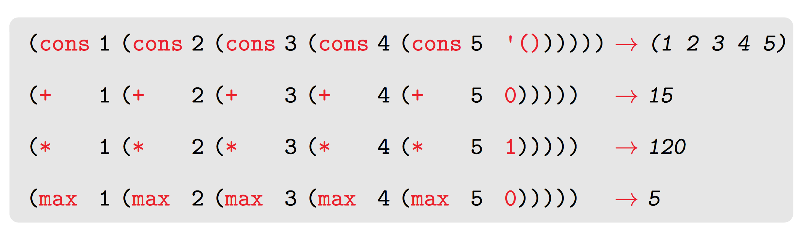

### Time 4

Vi så litt på “sekvensprosedyrer” i dag, altså `map`, `reduce` og `filter`.

Først brukte vi noen minutter på å se om vi huska hvordan man definerer `map`. Det anbefales å kunne den, ikke pugge, men hvis du skjønner hvordan den funker, så kommer du til å huske den ganske greit. Da jeg tok eksamen ble jeg i hvert fall nødt til å huske `map`!

###`map`

- Anvender en prosedyre på ethvert element i en liste og returnerer en ny liste med disse transformerte elementene.
- Man kan også lage `map` for trær, for eksempel (vilkårlig “dype” lister).

```scheme
(define (map proc list)
    (if (null? list)
        ‘()
        (cons (proc (car list))
              (map proc (cdr list)))))
```


###reduce

Denne anbefales også å kunne, så vi brukte noen minutter på å se om vi huska definisjonen.

I forelesning 3 fikk dere en skikkelig god beskrivelse av hvordan det funker — som var ny for meg:
Lister er en rekursiv datastruktur, bygget opp fra grunnverdien, base casen, altså den tomme lista, med kjeder av `cons`-operasjoner. Det `reduce` gjør er å re-kombinere elementene i lista med en ny operasjon og ny grunnverdi, slik som dette:



```scheme
(define (reduce proc init list)
    (if (null? list)
        init
        (proc (car list)
              (reduce proc init (cdr list)))))
```

`reduce` kan brukes til alt mulig rart, for det er en generalisering av rekursive prosesser. Enhver "vanlig" rekursiv operasjon med et grunntilfelle kan omformes til et kall på `reduce`.

###Eksempler
```scheme
(define (sum list) (reduce + 0 list))
(define (my-max list) (reduce max -9000 list)

(define (max-abs list)
    (reduce max 0 (map abs list)))

(define (length list)
    (reduce (lambda (sum element)
                (+ sum 1))
            0
            list))

(define (change-to-one x)
  1)

(define (my-length list)
  (reduce + 0 (map change-to-one list)))

(define (my-length list)
  (reduce (lambda (element sum) (+ 1 sum))
          0
          list))
```

Disse brukes faktisk en del i Java 8 og Javascript: Funksjonell programmering er i vinden!

###`filter`

Denne er også lur å huske, og "lett" å huske om man skjønner logikken. Den går over en liste og returnerer en ny liste der ethvert element innfrir predikatet.

```scheme
(define (filter list predicate)
  (cond ((null? list) '())
        ((predicate (car list))
         (cons (car list)
               (filter (cdr list) 
                       predicate)))
        (else
         (filter (cdr list)
                 predicate))))
```

```scheme
(define weird-list '(1 "Vegard" 2 "Stikbakke" 3.14 'pi
                       (newline) map + 3.14 (/ 100 3.56)))

(filter number? weird-list)
(filter string? weird-list)
```


###Oppgaver
- lag `length` ved hjelp av reduce
