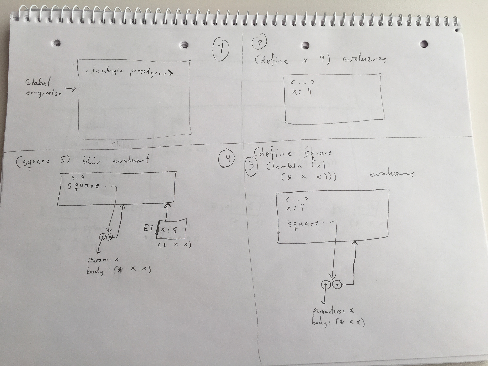
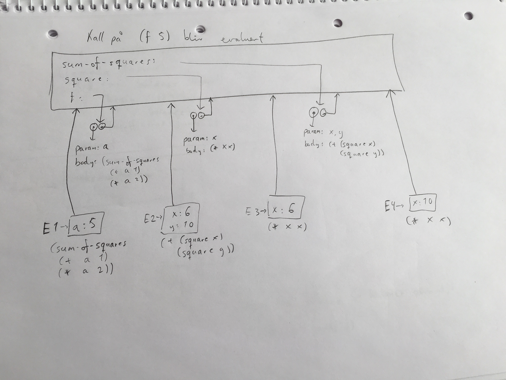
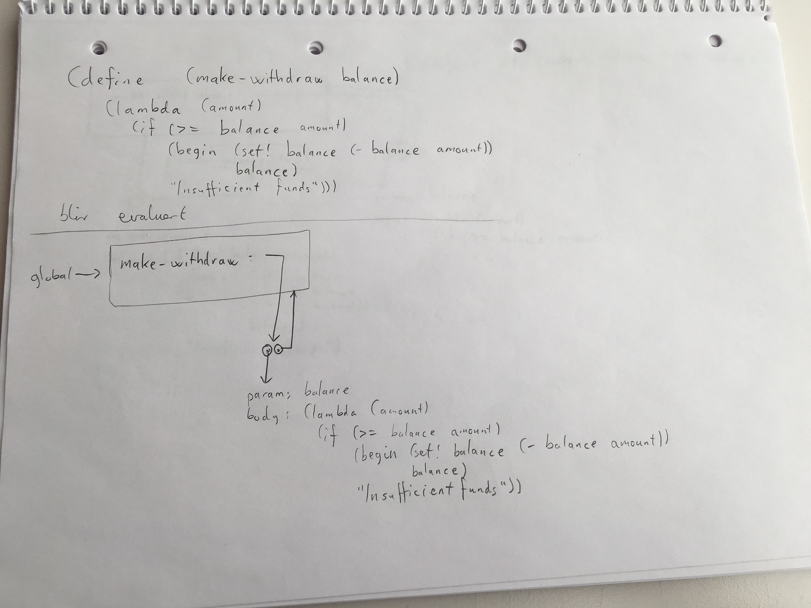
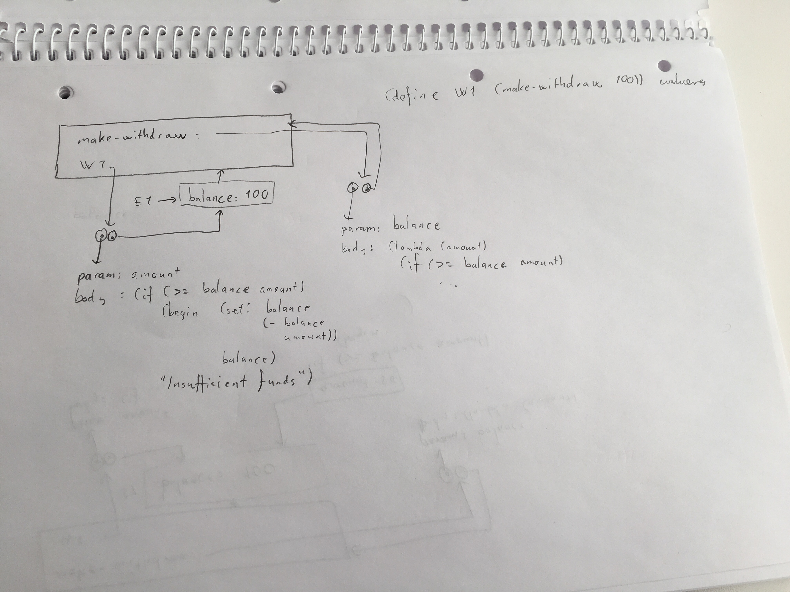
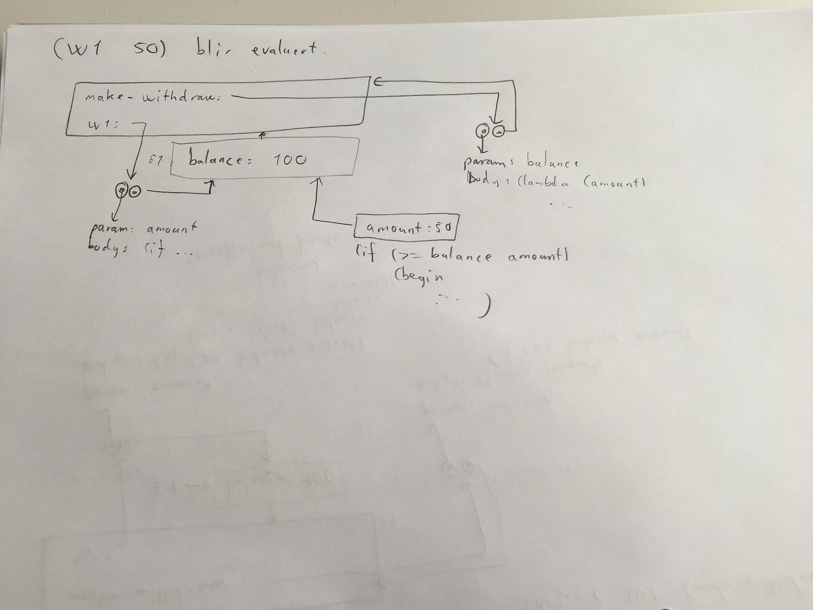

## Time 8

Vi så på omgivelsesmodellen.

Vi nevnte forrige gang at nå er ikke variabler lenger navn på verdier, men steder der verdier er lagret. Disse stedene kaller vi omgivelser, og det er det vi skal se på nå.

- **Omgivelse**: En sekvens av rammer.
- **Ramme**: En tabell som binder variabelnavn til verdier.
- Hver ramme har en peker til sin omsluttende omgivelse.
- Den globale omgivelsen består av én enkelt ramme
(med bindinger til alle de innebygde prosedyrene)
Variabler har sin verdi relativ til en gitt omgivelse

### Regler vi bruker

**1)** `define` legger til bindinger i en ramme (i «gjeldende ramme»), mens `set!` endrer dem (i «nærmeste» ramme).

**2)** Når et `lambda`-uttrykk evalueres i en gitt omgivelse opprettes en prosedyre. Prosedyren representeres som et «par» med en peker til parameterliste og prosedyrekropp, og en annen peker til omgivelsen der den ble opprettet.

**Regel 3**: Når en prosedyre anvendes (eller kalles), utvides prosedyrens omgivelse med en ny ramme der parametrene bindes til argumentverdiene.

### Eksempel 1
Se på ramme 1 til 4:

1. Vi starter med den globale omgivelsen, som inneholder alle de innebygde prosedyrene
2. Vi evaluerer `(define x 4)`, og, per regel 1, legger til en binding for variabel `x` til verdien `4`.
3. Evaluerer `(define square ...` og, per regel 2, oppretter en prosedyre.
4. Evaluerer `(square 5)`, og per regel 3, oppretter en ny ramme E1. Denne "blir borte" når evalueringen er ferdig.

### Eksempel 2
Jeg gikk gjennom et eksempel med `sum-of-squares` rett fra kapittel 3.2 i boka:

### Eksempel 3
Deretter eksemplet med `make-withdraw`:

### Oppgaver
- Gjør [oppgave 6 fra eksamen 2014]()!
- [Fasit her.]()
