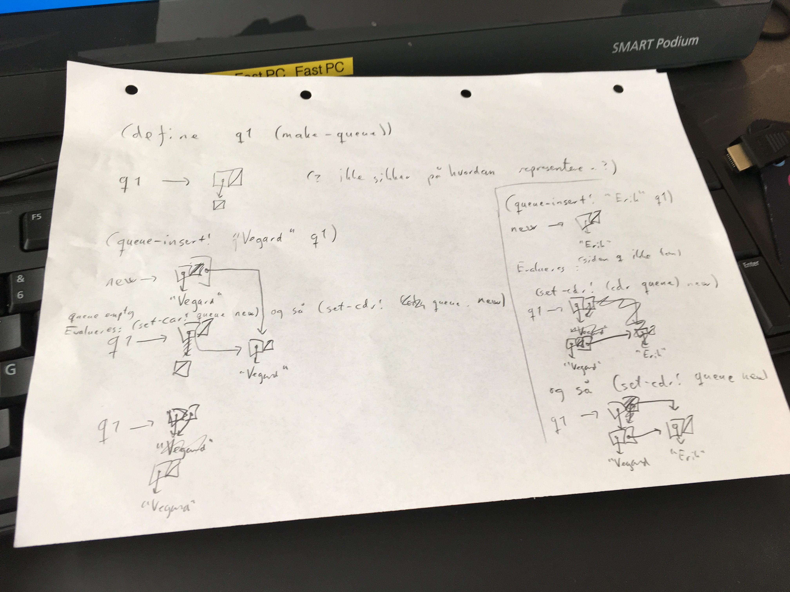

## Time 9

Vi repeterte fra forelesning om muterbare data (torsdag 9. mars), med boks-og-peker-diagrammer kombinert med set-car! og set-cdr!. Vi så også på eksempler med kø-grensesnittet, og hvordan køene ser ut med boks-og-peker.

Vi avsluttet med [denne Kahooten](https://play.kahoot.it/#/k/044bc78f-e9d1-4795-aecc-256bc60657b6).

### Boks-og-peker med `set-car!` og `set-cdr!`

```scheme
;; 1
(define x (list 1 2))
x ; (1 2)

;; 2
(set-cdr! x (list 3 4))
x ; (1 3 4)

;; 3
(define y (list "hei" "dere"))
y ; ("hei" "dere")

;; 4
(set-cdr! (cdr y)
          x)
y ; ("hei" "dere" 1 3 4)

;; 5
(set-cdr! x '())
x ; (1)
;; Hva er nå y?


;; 6
y ; ("hei" "dere" 1)
```


### Grensesesnittet for `queue`

```scheme
(define (make-queue)
  (cons '() '()))

(define (queue-empty? queue)
  (null? (car queue)))

(define (queue-insert! object queue)
  (let ((new (cons object '())))
    (if (queue-empty? queue)
        (set-car! queue new)
        (set-cdr! (cdr queue) new))
    (set-cdr! queue new)))

(define (queue-delete! queue)
  (if (queue-empty? queue)
      "Error: Empty queue."
      (let ((object (caar queue)))
        (set-car! queue (cdar queue))
        object)))
```

Vi så på hva som skjedde ved hvert steg her:

```scheme
(define q (make-queue))
(queue-insert! "Vegard" q)
(queue-insert! "Erik" q)
(queue-delete! q)
```

Her er et litt kjapt bilde av notatene mine. Kanskje kommer et fint et seinere!



### Oppgaver: Utvid grensesnittet til køer med funksjoner for å

- `front`: Skrive ut hvem som er fremst i køen
- `rear`: Skrive ut hvem som er bakerst
- `pretty-queue`: Skrive ut køen på en fin måte
- `queue-length`: Skrive ut lengden på køen
- Sende inn en kø i konstruktoren

Disse kan man gjøre enten som prosedyrer, eller som lokal tilstand inni `make-queue`.


### Kjappe løsninger

```scheme
(define (front queue)
  (caar queue))

(define (rear queue)
  (cadr queue))

(front q1)

(define (pretty-queue queue)
  (car queue))

(define (queue-length queue)
  (length (pretty-queue queue)))

(pretty-queue q1)

(define (make-queue2 . queue)
  (if (null? queue)
      (make-queue)
      (cons (car queue)
            (list (caar queue)))))

```
